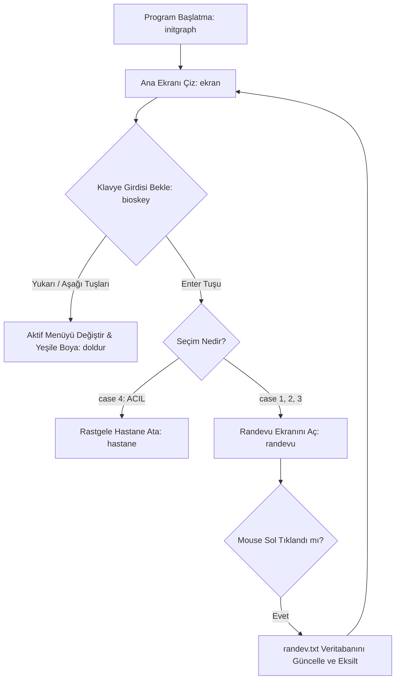

  

  
  
  

  
  

---

## 🐾 Proje Hakkında

**Vet-Graph OS**, Turbo C++ derleyicisi ve DOS ortamı için saf C diliyle geliştirdiğim, GUI temellerini görmek için yazdığım bir **Veteriner Randevu ve Acil Durum Yönetim Sistemi** simülasyonudur. 

Modern işletim sistemlerinin olmadığı dönemlerdeki düşük seviyeli (low-level) donanım yönetimini temel alır. Klavye yön tuşları (`bioskey`) ile menü navigasyonu sunar ve randevu onay işlemlerinde fare (mouse) kesmelerini (`interrupt 0x33`) aktif olarak kullanır.

---

## ⚡ Temel Özellikler

* **🕹️ İnteraktif Klavye Navigasyonu:** `bioskey(0)` fonksiyonu kullanılarak yukarı/aşağı yön tuşlarıyla menüler arasında dinamik geçiş ve yeşil renkli odaklanma (hover) efekti.
* **🖱️ Mouse Kesmesi (Interrupt 0x33) Desteği:** Randevu ekranında DOS seviyesinde fare imleci tetikleme ve sol tık algılama sistemi.
* **💾 Dosya Tabanlı Veritabanı:** Mevcut randevu kotasını `randev.txt` üzerinden dinamik olarak okuma ve güncel tutma.
* **🚨 Akıllı Acil Durum Modu:** `!!!ACIL!!!` seçeneğinde en yakındaki pati hastanesini (`srand` algoritmasıyla) otomatik olarak belirleme ve ekrana yazdırma.

---

## 🗺️ Menü Yapısı & Modlar

Sistem açıldığında kullanıcıyı 4 ana daldan oluşan bir işletim sistemi arayüzü karşılar:

| Menü Seçeneği | İşlev | Kullandığı Teknoloji |
| :--- | :--- | :--- |
| **Beslenme** | Evcil hayvan beslenme randevusu | BGI Menü Yönetimi |
| **Aşı Randevu** | Aşı ve Çip işlemleri planlaması | BGI Menü Yönetimi |
| **Kısırlıklaştırma** | Kısırlıklaştırma randevu ekranı | BGI Menü Yönetimi |
| **🚨 !!!ACIL!!!** | En yakın hayvan hastanesi konumu | `time.h` & `rand()` Algoritması |

---

### 🎯 Proje Lojik Akış Şeması
Projenin çalışma mantığı, DOS alt yapısındaki sonsuz döngü (`while(1)`) ve donanım kesmelerinin dinlenmesi üzerine kuruludur:

---

## 🚀 Çalıştırma Talimatları

Proje antik donanım kesmeleri ve `graphics.h` kütüphanesini kullandığı için doğrudan modern Windows/Linux/macOS terminalinde çalışmaz. Çalıştırmak için **Turbo C++** veya **DOSBox** emülatörüne ihtiyacınız vardır.

### DOSBox ve Turbo C++ ile Çalıştırma:

1.  **Veritabanı Hazırlığı:** `randev.txt` adında bir dosya oluşturun, içine `100` yazın ve bu dosyayı derleyicinizin `BIN` klasörüne yerleştirin (`C:\TURBOC3\BIN\randev.txt`).
2.  **Grafik Sürücüsü:** Kodun içindeki `initgraph(&gd,&gm," ");` kısmında, tırnak içine eğer gerekiyorsa BGI sürücünüzün yolunu verin (Örn: `"C:\\TURBOC3\\BGI"`).
3.  **Derleme:** Turbo C++ arayüzünde `F9` tuşuna basarak projeyi derleyin ve `Ctrl + F9` ile çalıştırın.

---

## 🎮 Kontrol Kılavuzu

* **`⬇️ Aşağı Ok Tuşu`** : Bir sonraki menü seçeneğine odaklanır.
* **`⬆️ Yukarı Ok Tuşu`** : Bir önceki menü seçeneğine odaklanır.
* **`⌨️ Enter Tuşu`** : Odaklanılmış olan menü fonksiyonunu tetikler.
* **`🖱️ Mouse Sol Tık`** : Randevu alma ekranında "RANDEVU AL" butonuna tıklandığında randevu sayısını düşürür.

---

  

